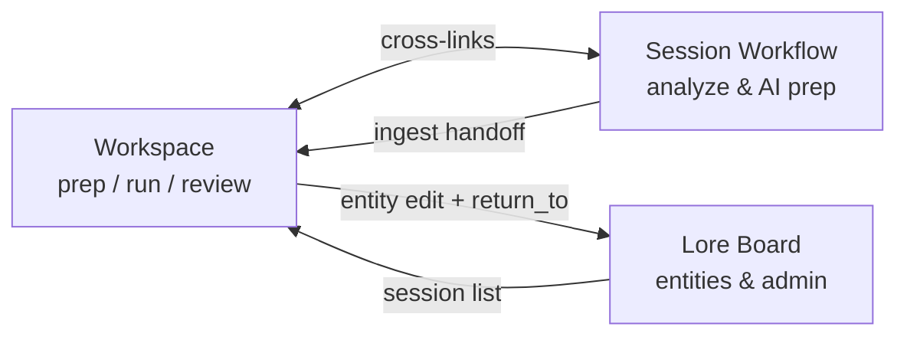

# GM Mission Control — UI Specification

Visual reference: Stitch/Galileo exports in [`mockup/`](mockup/). Token source: [`mockup/obsidian_terminal/DESIGN.md`](mockup/obsidian_terminal/DESIGN.md).

Implementation: FastAPI + Jinja + local CSS (`app/static/css/mission_control.css`). No Tailwind CDN, no npm build, no React.

---

## 1. Design principles

| Principle | Application |
|-----------|-------------|
| Information density | Tight padding (8–12px), visible module headers, minimal decorative whitespace |
| Systemic clarity | Entity health uses red / amber / green protocol |
| Tactical utility | Inset inputs, 1px structural borders, cyan focus glow |
| Self-hosted | All CSS/JS under `app/static/`; system font stack fallbacks |

---

## 2. Design tokens (CSS variables)

Defined in `app/static/css/mission_control.css`:

| Token | Hex | Usage |
|-------|-----|--------|
| `--bg` | `#041426` | Page background |
| `--panel` | `#102032` | Cards, modules |
| `--panel-high` | `#1b2b3d` | Hover, elevated rows |
| `--panel-low` | `#0c1c2e` | Sidebars |
| `--panel-lowest` | `#000f20` | Inset editors |
| `--text` | `#d4e4fc` | Primary text |
| `--muted` | `#849396` | Secondary labels |
| `--muted-variant` | `#bac9cc` | Body secondary |
| `--accent` | `#00e5ff` | Links, focus, active nav |
| `--tertiary` | `#4ae176` | Workspace accent, success actions |
| `--on-tertiary` | `#041426` | Text on tertiary/green fills (buttons, mode tabs) |
| `--success` | `#69f0ae` | Complete status |
| `--warning` | `#ffd740` | Partial status |
| `--danger` | `#ff5252` | Minimal status, delete |
| `--border` | `#3b494c` | Standard borders |
| `--border-subtle` | `#1b2b3d` | Panel seams |

Typography: `--font-sans` (Segoe UI / system-ui), `--font-mono` (Consolas / monospace).

Type scale:

- **Headline LG** — 22–28px, bold, -0.02em tracking (page titles)
- **Headline MD** — 16–20px, semibold (module titles)
- **Label caps** — 10–11px, bold, 0.08em tracking (NPC, LOCATION, STATUS)
- **Body** — 14px / **Body SM** — 12–13px
- **Mono data** — 13px monospace (workspace editor, prep blocks)

Radius: `--radius: 4px` everywhere (no pills except status dots).

---

## 3. App shell

All pages use `base.html` (Mission Control shell).

```
┌─────────────────────────────────────────────────────────────┐
│ TOP BAR: brand · nav · mode tabs (workspace) · campaign ▼  │
├──────────┬──────────────────────────────────┬───────────────┤
│ SIDEBAR  │ MAIN CONTENT                     │ REF PANEL     │
│ (256px)  │ (fluid)                          │ (320px)       │
│ optional │                                  │ workspace only│
└──────────┴──────────────────────────────────┴───────────────┘
```

### Layout modes

| Mode | Class | Sidebar | Ref panel | Pages |
|------|-------|---------|-----------|-------|
| `minimal` | `.layout-minimal` | No | No | Campaign list (`/`) |
| `dashboard` | `.layout-dashboard` | Yes | No | Campaign detail, session detail, forms, ingest |
| `workspace` | `.layout-workspace` | Session tree | In-context refs | `/campaigns/{id}/workspace` |

### Top navigation (when campaign context exists)

**Dual-hub model** — Workspace and Session Workflow are peers; Lore Board is entity admin.

```
Workspace · Session Workflow · Lore Board · Ingest · Search · Settings
```

| Nav item | Route | Role |
|----------|-------|------|
| Workspace | `/campaigns/{id}/workspace?session_id=…&mode=…` | Live prep, run-time notes, ref panel |
| Session Workflow | `/campaigns/{id}/sessions/{id}` | Notes → Analyze → Prep → AI drafts |
| Lore Board | `/campaigns/{id}` | Entity CRUD, completeness, session admin |

Mode tabs (Prep · Run · Review) appear in the top bar on Workspace only.

Brand link and campaign selector default to **Workspace** (with last session/mode from cookies/localStorage).

### Dual-hub flow



Persistence: `mc.js` writes `mc:last_campaign_id`, `mc:last_session:{id}`, `mc:last_mode:{id}` to localStorage and cookies so hub links stay session-aware across pages.

Return paths: `return_to` query param on entity edit links from Workspace ref panel; post-save redirects honor it when same-origin.

---

## 4. Page specifications

### 4.1 Campaign list (`/`)

**Mockup:** `mockup/campaign_dashboard/` (simplified)

- Layout: `minimal`
- Hero: none; simple page title "Campaigns"
- Left: list of campaign cards (name, system, description excerpt)
- Right: "New Campaign" module (inset form)
- Command actions become dashboard quick tiles on campaign detail

### 4.2 Lore Board (`/campaigns/{id}`)

**Mockup:** `mockup/campaign_dashboard/code.html`

- Layout: `dashboard`, `active_nav: dashboard`
- Tagline: campaign entities and completeness — not the live play surface
- Hero block:
  - Label chip: **Lore Board**
  - H1: campaign name (accent/cyan)
  - Subtitle: system + tagline
- Command bar: **Brief Me** tile first (span-2, accent border), then Workspace · Ingest · AI Review · Search · …
- Session list: title links to **Workspace**; secondary link to Session Workflow
- Left column: Entity Completeness Overview, Sessions list
- Right column: Entity modules (NPCs, Locations, …) with health badges and **Last seen** / **Last touched** on list rows
- Dashboard widgets: Quick Resume, Next Session, Last Analyzed, Active Plot Threads, Recently Seen NPCs, Needs Attention
- **Campaign Intelligence strip** (when sessions exist): attention items or **All clear** when no dormant/stale signals; links to Briefing

### 4.3 Session detail (`/campaigns/{id}/sessions/{id}`)

**Mockup:** `mockup/session_detail_page/code.html`

- Layout: `dashboard`, `active_nav: sessions`
- Hero: session title, date, campaign breadcrumb
- Action bar: Back · Workspace · Player View · Export · Clear AI
- GM Workflow module (highlight border accent)
- Two-column bento: notes + AI drafts
- Alerts: success / warning / info using status colors

### 4.4 Session workspace (`/campaigns/{id}/workspace`)

**Mockup:** `mockup/session_workspace_*`

- Layout: `workspace`, `active_nav: workspace`
- Mode tabs: Prep · Run Session · Review (`?mode=prep|run|review`)
- Center: large monospace textarea (`workspace_notes`), Save, Copy AI Prep
- Right ref panel: linked NPCs, Locations, Factions, Items, Plot Threads, Session Prep, Quick Capture (+NPC …)
- **Intelligence badges** on ref cards: NPC/location/faction/item `new` · `returning`; thread `new` · `dormant` · `unlinked`
- **Session history** on each ref card (compact timeline, up to 5 sessions)
- **Prep-gap banner** when session has notes but no analysis, or analysis but no prep draft
- Mode affects ref panel emphasis (prep expands Session Prep; run emphasizes capture)

### 4.5 Entity edit (`/campaigns/{id}/npcs/{id}/edit`, etc.)

**Mockup:** `mockup/npc_detail_page/code.html`

- Layout: `dashboard`, `active_nav` by entity type
- **Health badge** at top (score + missing fields tooltip)
- **History** panel: First Seen / Last Seen, Appears In Sessions (chronological links), Related Entities (current links), Statistics, status badges (new / active / dormant)
- **Relationship History** panel: linked / unlinked audit log (entity edits + ingest; forward-only)
- **Co-appearance Timeline** panel: sessions where linked partners appeared together (session-link based)
- Single module card with inset fields
- Checkbox link panels for relationships
- Primary save + ghost cancel (`return_to` honored when set)

### 4.7 Brief Me (`/campaigns/{id}/briefing`)

Pre-session digest assembled deterministically from session links, recaps, entity health, and analysis state.

- Layout: `dashboard`, `active_nav: dashboard`
- Hero label: **Brief Me**
- Sections: Campaign Health + Quick Actions (bonus), Last Session, Active Plot Threads, Important NPCs, Recent Developments, Unresolved Questions, Dormant Threads, Needs Attention, optional Summary (local digest + AI paragraph), Stale Entities when applicable
- **Generate AI Summary** — POST `/briefing/generate-narrative` when LLM configured; stored on campaign (optional; briefing loads without AI)
- Actions: **Print / Export** (`/briefing/print` — standalone print layout, `print.css`), **Download Markdown** (`/briefing/export/markdown`)
- Data: `load_campaign_briefing_data()` + `build_campaign_briefing_sections()` in `app/services/briefing_sections.py`

### 4.6 Ingest / AI review / Search / Timeline / Settings

- Same shell and tokens
- Form modules + alert banners
- No layout changes to backend routes

---

## 5. Components

### Buttons

| Class | Use |
|-------|-----|
| `.mc-btn` / `.btn` | Default ghost |
| `.mc-btn-primary` / `.btn-primary` | Save, create (tertiary green, `--on-tertiary` text) |
| `.mc-btn-accent` | Copy prep, AI actions (cyan) |
| `.mc-btn-danger` / `.btn-danger` | Delete confirm |
| `.btn-outline-*` | Secondary actions |

Height ~32px, label caps optional on primary actions.

### Cards / modules

`.card` → `--panel` background, `--border-subtle` border, 4px radius.

`.card-header` → `--panel-high`, label caps style, bottom border.

`.card-body` → 12px padding.

Status border accents: `.status-minimal` (red left), `.status-partial` (amber), `.status-complete` (green).

### Forms

`.form-control`, `.form-select` → inset (`--panel-lowest`), cyan focus ring.

`.form-label` → label caps, muted color.

### Entity health chips

Green ≥80% · Yellow 40–79% · Red &lt;40%. Tooltip via `title` attribute listing missing: Description, Notes, Relationships.

### Type badges

`[NPC]` `[LOCATION]` `[FACTION]` `[ITEM]` `[THREAD]` `[PC]` — dark badge, 10px caps.

### Intelligence badges (workspace ref panel)

| Class | Meaning |
|-------|---------|
| `.mc-intel-new` | First session appearance |
| `.mc-intel-returning` | Back after appearing in an earlier session |
| `.mc-intel-dormant` | Active thread not touched within intelligence gap |

Gap default: 2 sessions behind current/persisted session (`DEFAULT_INTELLIGENCE_GAP` in `campaign_intelligence.py`). Override with env `INTELLIGENCE_GAP` (minimum 1).

---

## 6. Bootstrap class compatibility

Legacy templates keep Bootstrap class names; `mission_control.css` restyles them under `.mc-body` so migrations are incremental. New work should prefer `.mc-*` classes.

---

## 7. Static assets

| Path | Purpose |
|------|---------|
| `app/static/css/mission_control.css` | Tokens + layout + component compat |
| `app/static/css/print.css` | Campaign Briefing print/export layout |
| `app/static/js/htmx.min.js` | HTMX (self-hosted) |
| `app/static/js/mc.js` | Draft forms, persistence, sidebar drawer, Continue card |

---

## 8. Template map

| Template | Layout | extends |
|----------|--------|---------|
| `campaigns.html` | minimal | `base.html` |
| `campaign_detail.html` | dashboard | `base.html` |
| `session_detail.html` | dashboard | `base.html` |
| `session_workspace.html` | workspace | `base.html` |
| `entity_form.html` | dashboard | `base.html` |
| `campaign_briefing.html` | dashboard | `base.html` |
| `campaign_briefing_print.html` | standalone (no shell) | — |
| `confirm_delete.html` | dashboard | `base.html` |
| `ingest*.html`, `ai_review.html`, etc. | dashboard | `base.html` |

Context helper: `app/services/mission_control_ui.py` → `mc_context()`.

---

## 9. YunoHost / production

- Serve via uvicorn/gunicorn + nginx
- Static files from `app/static/`
- SQLite path unchanged (`campaign_console.db`)
- `.env` for LLM settings unchanged
- No external CDN dependencies in production HTML

---

## 10. Mobile

Below 768px the sidebar is hidden; a **☰** toggle in the top bar opens a drawer overlay (workspace and dashboard layouts). Ref panel hides below 1100px.

Campaign list (`/`) shows a **Continue** card when `mc:last_campaign_id` is set in localStorage.

Manual regression steps: see [`REGRESSION_CHECKLIST.md`](REGRESSION_CHECKLIST.md) at project root.

---

## 12. Campaign Intelligence (services)

| Service | Role |
|---------|------|
| `campaign_intelligence.py` | Session history, dormancy/stale signals, workspace flags, briefing assembly |
| `entity_history_panel.py` | Unified History panel (sessions, related entities, stats, badges) |
| `entity_session_presence.py` | Presence index; `last_seen_session_id` / `last_touched_session_id` refresh |
| `relationship_history.py` | `EntityRelationshipEvent` audit log |
| `entity_health.py` | Completeness scoring, Needs Attention list |
| `campaign_dashboard.py` | Lore Board widget data (includes intelligence strip) |

Session links are the source of truth for temporal intelligence. Relationship history is a separate audit trail for entity–entity link changes. Manual entity edits attribute `session_id` from `return_to` (workspace or session workflow URL) or the persisted `mc_session_{campaign_id}` cookie when no return path is set.

---

## 11. Out of scope (future)

- React / Vue / frontend router
- Tailwind build pipeline
- Material icon font (use text labels / Unicode fallbacks)
- Full workspace mode logic (center panel varies by mode)
- Authentication changes
- htmx slide-over entity edit from ref panel
